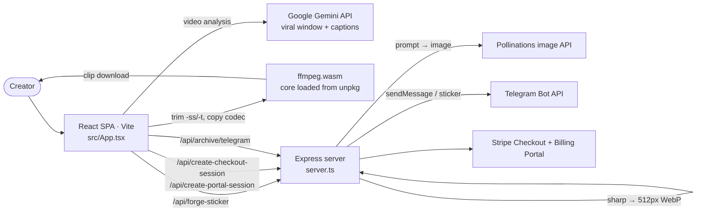

# STIX CUT — MΛGIC Clipping

**Find the most viral moment in a video with Gemini, trim it in the browser with ffmpeg.wasm, and forge matching stickers**

    

A STIX MAGIC web app for short-form creators. You drop in a video (MP4, MOV or WEBM). **Gemini** analyzes it and returns the viral window (start and end timestamps) plus aesthetic caption suggestions, and the app then **trims that segment entirely in the browser** with ffmpeg.wasm and downloads the clip. A small Express server adds a **sticker forge**: it builds a styled prompt, fetches a generated image from Pollinations, converts it with `sharp` to a 512 × 512 lossless WebP and can post it to a Telegram chat. The server also handles **Stripe** Checkout (a Pro price or a "Stars" price) with a billing portal, and a Telegram archive endpoint. It was scaffolded in Google AI Studio ([app link](https://ai.studio/apps/d87dd599-0490-4761-b4a1-7bc18a4748b3)). It's for STIX MAGIC / ClipsFlow creators cutting hooks from long videos.

## Architecture



## Stack

- React 19 + TypeScript, Vite, Tailwind CSS, Motion, Lucide
- `@google/genai` (Gemini), `@ffmpeg/ffmpeg` (ffmpeg.wasm)
- Express (`server.ts`, run with `tsx`), `sharp`, Stripe

## Project structure

```text
src/App.tsx     upload, Gemini analysis, in-browser trim, sticker UI, paywall
server.ts       Express: /api/forge-sticker, /api/create-checkout-session,
                /api/create-portal-session, /api/archive/telegram + Vite / static
fly.toml        Fly.io app config
Dockerfile      static file server image (gostatic)
```

## Local development

```bash
npm install

# fill in the names below
cp .env.example .env.local

# tsx server.ts (API + Vite middleware)
npm run dev

# tsc --noEmit
npm run lint

# vite build → dist/
npm run build

npm run preview
```

> ⚠️ `GEMINI_API_KEY` is injected into the client bundle (`vite.config.ts` `define`), so any public build exposes it. Move the Gemini calls behind the server before shipping publicly.

## Environment variables

Names only (see `.env.example`).

`GEMINI_API_KEY`, `APP_URL`, `TELEGRAM_BOT_TOKEN`, `TELEGRAM_CHAT_ID`, `STRIPE_SECRET_KEY`, `VITE_STRIPE_PUBLISHABLE_KEY`, `STRIPE_PRICE_ID`, `STRIPE_STARS_PRICE_ID`, `DISABLE_HMR`

## Deploy

The repo contains a `fly.toml` (Fly.io app `stix-cut-app`, internal port 8073) and a `Dockerfile` that only serves static files with gostatic on port 8080. Those two don't match each other or the Express server, and the static image wouldn't serve the `/api/*` routes. `npm start` (`tsx server.ts`) is the full-stack entry point.
